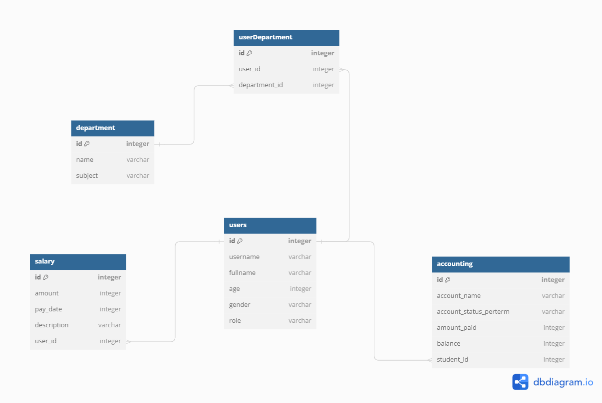

# Project: Kims School Complex Management System

## Project Developer: Group 9

---

## Introduction 

The Kims School Complex in the Democratic Republic of Congo is upgrading its website from Wixsite to a more robust and functional platform built with React and Flask. 
This new system will streamline school management and improve communication with students, teachers, and administrators.

---

## Setup 

To get set up, run:

```console
$ pipenv install && pipenv shell
$ npm install --prefix client
$ cd server
```
You can run the Flask server with:

```console
$ python app.py
```

Note that running `python app.py` will generate an error if you haven't created
your models and run your migrations yet.

And you can run React in another terminal from the project root directory with:

```console
$ npm start --prefix client
```
---
## Models
#### Users: 
Students
Teachers (School staff)
Admin

#### Department:
Program
Any other additional information related to the course: attendance

#### Accounting:
Show the fee status for student 
Show a full accounting report for the Admin

#### Salary:
Show the salary for Teachers


### Roles
Teachers: should be able to see the student under his class, check the attendance of the students and be able to assign the marks to a certain student

Admin: can be able to delete the student, delete a teacher, see the finanacial status of a student and print a report (All the CRUD including the report generation)

Student: can see his result, can see his courses and can also his financial status (fee balance)

### Relationships



A User(students or teachers) has many Department  through UserDepartment         (dont forget constraints)

A Department has many Users  through UserDepartment 

UserDepartment is a many to many relationship


A UserDepartment belongs to User

A UserDepartment belongs to Department

A User has many Accounting through UserAccounting (One to One)


#### Tables

Users table

Department table 

Accounting table

UserDepartment (Association object) 

Salary table

job posting table

News table


